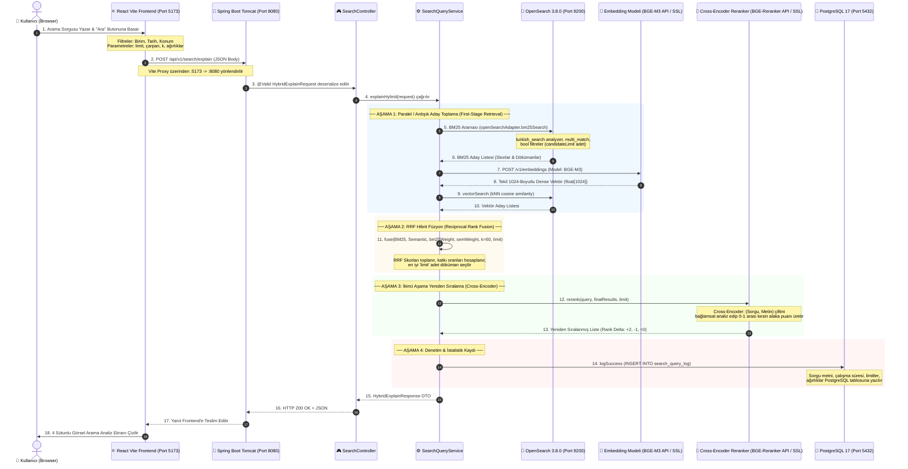

# 🔍 Uçtan Uca Arama Akışı ve Mimari Derin Dalış Rehberi
*(End-to-End Search Pipeline & Request Lifecycle Architecture)*

Bu doküman, bir kullanıcının arama kutusuna bir sorgu yazıp arattığı andan itibaren isteğin ağ üzerinde nereye gittiğini, kimin karşıladığını, hangi sınıfların ve motorların sırasıyla nasıl çalıştığını ve sonucun tarayıcıya nasıl döndüğünü **uçtan uca, tüm teknik detaylarıyla** adım adım açıklamaktadır.

---

## 🗺️ 1. Uçtan Uca Sistem Mimarisi & İstek Yaşam Döngüsü

Aşağıdaki sıra diyagramı (sequence diagram), tarayıcıdan başlayıp veritabanlarına kadar uzanan tüm yolculuğu özetlemektedir:



---

## 🖥️ 2. Adım Adım Detaylı Akış

---

### ADIM 1: Kullanıcı Arayüzü (Frontend) & İstek Formatı

Kullanıcı `http://localhost:5173` adresindeki arama kutusuna örneğin `"İstanbul boğazı şüpheli gemi"` yazar ve filtreleri belirler.

#### 1. İstek Nereye Atılır?
* **Frontend İstek URL:** `http://localhost:5173/api/v1/search/explain`
* **Vite Proxy Yönlendirmesi:** `frontend/vite.config.ts` dosyasında yer alan proxy kuralı sayesinde istek arka planda doğrudan Spring Boot sunucusuna aktarılır:
  $$\text{http://localhost:5173/api/...} \longrightarrow \text{http://localhost:8080/api/...}$$
* **HTTP Metodu:** `POST`
* **HTTP Headers:**
  ```http
  Content-Type: application/json
  Accept: application/json
  ```

#### 2. Gönderilen JSON İstek Gövdesi (Payload Örneği):
```json
{
  "query": "İstanbul boğazı şüpheli gemi",
  "indexName": "olaylar",
  "searchType": "HYBRID",
  "limit": 10,
  "candidateMultiplier": 3,
  "rankConstant": 60,
  "bm25Weight": 0.5,
  "semanticWeight": 0.5,
  "types": ["OLAY"],
  "filters": {
    "birim": "Sahil Güvenlik Komutanlığı",
    "startDate": "2025-01-01T00:00:00Z",
    "endDate": "2026-12-31T23:59:59Z",
    "lat": 41.123,
    "lon": 29.085,
    "radiusKm": 50
  }
}
```

> **Önemli Parametreler:**
> * `limit`: Sonuç tablosunda gösterilecek nihai olay sayısı (örn: `10`).
> * `candidateMultiplier`: İlk aşamada motorlardan kaç kat aday çekileceği (örn: `3` ise `10 x 3 = 30` aday toplanır).
> * `rankConstant`: RRF sıralama yumuşatma katsayısı ($k=60$).
> * `bm25Weight` & `semanticWeight`: BM25 ve Vektör aramasının bağıl ağırlıkları.

---

### ADIM 2: Karşılama Katmanı (Tomcat, CORS ve SearchController)

1. **Embedded Tomcat (`port: 8080`)**:
   - HTTP isteğini kabul eder. `Security` ve `CORS Filter` katmanından geçirir (`http://localhost:5173` kökenine izin verilir).
2. **`SearchController.java` (`/api/v1/search/explain`)**:
   - Spring Boot Jackson kütüphanesi gelen JSON gövdesini `HybridExplainRequest` Java nesnesine dönüştürür.
   - Jakarta Validation (`@Valid`) devreye girer:
     - Sorgu boş olamaz (`@NotBlank`).
     - Ağırlıkların toplamı sıfırdan büyük olmalıdır (`@AssertTrue`).
     - Limit 1 ile 100 arasında olmalıdır (`@Min`, `@Max`).
3. İstek doğrulamadan geçince `searchQueryService.explainHybrid(request)` metodu tetiklenir.

---

### ADIM 3: Arama Servisi Hazırlık Aşaması (`SearchQueryService.java`)

Arama servisi isteği aldığında kronometreyi başlatır (`startedAt = System.currentTimeMillis()`) ve parametreleri hesaplar:

1. **Hedef İndeks:** Belirtilmemişse varsayılan `olaylar` indeksi seçilir.
2. **Limitler:**
   * Nihai sonuç limiti: `limit = 10`
   * Aday Havuzu Limiti:
     $$\text{candidateLimit} = \min(10 \times 3, 100) = 30$$
3. **Ağırlık Normalizasyonu:**
   $$W_{\text{toplam}} = 0.5 + 0.5 = 1.0 \implies w_{BM25} = 0.5, \quad w_{SEM} = 0.5$$
4. **Filtrelerin Hazırlanması:** Birim, Tür, Tarih aralığı ve GPS mesafe filtreleri OpenSearch DSL formatına dönüştürülmek üzere hazırlanır.

---

### ADIM 4: Birinci Aşama (1) — OpenSearch BM25 Kelime Araması

Sistem ilk olarak kelime bazlı tam metin (lexical) aramasını icra eder:

1. **Metot Çağrısı:** `openSearchAdapter.bm25Search("olaylar", query, filters, candidateLimit=30)`
2. **OpenSearch'e Giden HTTP İsteği:**
   * **URL:** `POST http://localhost:9200/olaylar/_search`
   * **Sorgu DSL Gövdesi:**
     ```json
     {
       "size": 30,
       "query": {
         "bool": {
           "must": [
             {
               "multi_match": {
                 "query": "İstanbul boğazı şüpheli gemi",
                 "fields": ["title^2", "shortText^1.5", "searchText", "longText", "adres", "birim"],
                 "analyzer": "turkish_search",
                 "operator": "OR"
               }
             }
           ],
           "filter": [
             { "term": { "type.keyword": "OLAY" } },
             { "term": { "birim.keyword": "Sahil Güvenlik Komutanlığı" } }
           ]
         }
       }
     }
     ```
3. **Analizör:** OpenSearch içindeki `turkish_search` analizörü kelimelerin Türkçe köklerini ayıklar (`boğazı -> boğaz`, `şüpheli -> şüphe`).
4. **Dönen Cevap:** OpenSearch, TF-IDF / Okapi BM25 formülüyle en yüksek skora sahip ilk 30 dökümanı döner.

---

### ADIM 5: Birinci Aşama (2) — Semantik Arama (Dense BGE-M3)

1. **Dense Vektör Üretimi (`EmbeddingProvider.java`):**
   * Metin gömme modeli (Model API veya Hugging Face TEI / `BAAI/bge-m3`) çağrılır:
     * **İstek URL:** `POST {EMBEDDING_ENDPOINT}` (Örn: `https://model-server.airgap.lan/v1/embeddings` veya `http://localhost:8081/embed`)
     * **Dönen Cevap:** `1024` boyutlu tekil dense vektör: `float[1024]`
   * Geliştirme ortamında model kapalıysa deterministik mock gömme kullanılır.

2. **OpenSearch kNN Vektör Araması (`OpenSearchAdapter.java`):**
   * **İstek URL:** `POST http://localhost:9200/olaylar/_search`
   * **JSON Gövdesi:**
     ```json
     {
       "size": 30,
       "query": {
         "knn": {
           "embedding": {
             "vector": [-0.0283, 0.0035, ..., 0.0138],
             "k": 30
           }
         }
       }
     }
     ```
   * OpenSearch HNSW indeksi üzerinden kosinüs mesafesine göre en yakın 30 dökümanı çeker.

---

### ADIM 6: Birleştirme Katmanı — RRF (Reciprocal Rank Fusion)

Artık elimizde iki ayrı aday havuzu vardır:
* **Havuz 1:** 30 Adet BM25 Sonucu (Lucene TF-IDF skorlu)
* **Havuz 2:** 30 Adet Semantik Sonucu (Kosinüs benzerlik skorlu)

Farklı skor skalalarını mutlak değerleriyle toplamak yanlış sonuç vereceğinden **RRF Algoritması** devreye girer:

$$RRF(d) = \frac{w_{BM25}}{k + rank_{BM25}(d)} + \frac{w_{SEM}}{k + rank_{SEM}(d)}$$

* $k = 60$ (Rank sabiti)
* Bir döküman sadece tek bir listede varsa diğer sırası sonsuz kabul edilir.
* Her iki listede de üst sıralarda yer alan dökümanlar en yüksek birleşik skoru alır.
* Katkı oranları hesaplanır:
  * $\text{bm25Contribution} = \frac{w_{BM25}}{60 + rank_{BM25}}$
  * $\text{semanticContribution} = \frac{w_{SEM}}{60 + rank_{SEM}}$
* Liste RRF skoruna göre azalan sırada dizilir ve ilk **10 döküman** (`limit`) seçilir.

---

### ADIM 7: İkinci Aşama — Cross-Encoder Reranker

Birinci aşama sonucunda belirlenen en iyi adaylar, derin anlamsal doğrulama için ikinci aşama nöral yeniden sıralayıcıya (`TeiRerankingService.java` -> Hugging Face TEI / `BAAI/bge-reranker-v2-m3` veya saf Java yedek motoru) girer.

1. **Tam Çapraz Dikkat (Full Cross-Attention Mekanizması):**
   * Tekil (bi-encoder) vektörlerin aksine, `(Sorgu, Döküman Metni)` çifti modele birlikte verilir ve her bir sorgu token'ı dökümanın her bir kelimesiyle doğrudan çapraz dikkat kurar.
   * Kelimelerin bağlamsal sırası, olumsuzluk ekleri (`"bulunamadı"`, `"sağ kurtarıldı"`), unvan ve birim eşleşmeleri nöral ağırlıklarla değerlendirilir.
2. **Nöral Puanlama:** Model her çift için sigmoid/softmax ile 0.0000 ile 1.0000 arasında saf bir `relevanceScore` üretir.
   * Anlamsız/gibberish sorgularda model `~0.00` üretirken, semantik olarak örtüşen dökümanlar `0.90+` alarak en üste taşınır.
3. **Sıralama Değişimi (Rank Delta):**
   * İlk aşamada geri sıralarda kalan bir olay, Cross-Encoder analizinde sorguyla birebir anlamsal uyum sağlarsa ilk sıraya yükselebilir ($\Delta = +4$).

---

### ADIM 8: Kalıcılık & Denetim — PostgreSQL Veritabanı Loglaması

Arama tamamlandığında `SearchQueryLogService.java` devreye girer:
* **Veritabanı:** PostgreSQL 17 (`port: 5432`, db: `semantic_search`)
* **Tablo:** `search_query_log`
* **Sequence:** `search_query_log_seq`
* **Kaydedilen Veriler:**
  * Kullanıcı sorgusu (`"İstanbul boğazı şüpheli gemi"`)
  * Arama tipi (`HYBRID`)
  * Toplam geçen süre (`tookMs`)
  * Kullanılan ağırlıklar (`bm25Weight: 0.5`, `semanticWeight: 0.5`)
  * Aday limiti (`30`), RRF sabiti (`60`), dönen sonuç sayısı (`10`)
  * Zaman damgası (`Instant.now()`)

---

### ADIM 9: Yanıt Formatı & Frontend Görselleştirme

Spring Boot, `HybridExplainResponse` nesnesini JSON olarak serialize eder ve HTTP 200 OK ile React istemcisine iletir:

#### Dönen JSON Yanıt Formatı:
```json
{
  "query": "İstanbul boğazı şüpheli gemi",
  "indexName": "olaylar",
  "totalTookMs": 14,
  "settings": {
    "limit": 10,
    "candidateLimit": 30,
    "candidateMultiplier": 3,
    "rankConstant": 60,
    "bm25Weight": 0.5,
    "semanticWeight": 0.5
  },
  "bm25Stage": {
    "stageName": "BM25",
    "tookMs": 3,
    "results": [
      {
        "rank": 1,
        "originalScore": 14.82,
        "document": {
          "id": "6d439641-71e0-42cf-9cf0-9a104f65eba1",
          "title": "Silopi Sınır Geçiş Noktası Bölgesinde Arama Kurtarma Faaliyeti...",
          "shortText": "İl Jandarma Komutanlığı, 8 Şubat 2026 tarihinde...",
          "birim": "İl Jandarma Komutanlığı",
          "tarih": "2026-02-08T20:24:00Z",
          "konum": { "lat": 37.2827, "lon": 42.5479 }
        }
      }
    ]
  },
  "semanticStage": {
    "stageName": "SEMANTIC",
    "tookMs": 4,
    "results": [
      {
        "rank": 1,
        "originalScore": 0.8912,
        "document": { "id": "6d439641-..." }
      }
    ]
  },
  "finalResults": [
    {
      "finalRank": 1,
      "rrfScore": 0.01639,
      "bm25Rank": 1,
      "semanticRank": 1,
      "bm25Contribution": 0.00819,
      "semanticContribution": 0.00819,
      "document": { ... }
    }
  ],
  "rerankStage": {
    "tookMs": 1,
    "results": [
      {
        "finalRank": 1,
        "relevanceScore": 0.9412,
        "delta": 0,
        "result": { ... }
      }
    ]
  }
}
```

#### Frontend'deki 4 Sütunlu Görsel Çıktı:
React arayüzü (`frontend/src/App.tsx`) bu zengin JSON verisini alır ve ekranda 4 ayrı sütun halinde gösterir:
1. **Sütun 1 (Mavi / Turuncu):** 📄 **BM25 Adayları** (Eşleşen kelime vurguları ve TF-IDF skorları).
2. **Sütun 2 (Sarı):** 🧠 **Semantik Adayları** (BGE-M3 1024-boyutlu HNSW vektör benzerliği).
3. **Sütun 3 (Turuncu):** 🔀 **RRF Birleşik Sıralama** (BM25 ve Vektör motorlarının katkı çubukları).
4. **Sütun 4 (Koyu Kehribar):** 🎯 **Cross-Encoder Yeniden Sıralama** (Sıralama değişim rozetleri: `▲ +2`, `▼ -1`).

Her bir olayın üzerine tıklandığında açılır panel ile dökümanın tam harekat raporu (`longText`), koordinatları ve bağlı birliği görüntülenebilir.

---

## 📌 Arama Motoru Karşılaştırması

| Aşama / Özellik | Kelime Araması (BM25) | Yoğun Vektör Araması (Dense BGE-M3) | Çapraz Kodlayıcı (Cross-Encoder) |
| :--- | :--- | :--- | :--- |
| **Yöntem** | Lucene Okapi BM25 | 1024-Boyutlu k-NN HNSW | BAAI/bge-reranker-v2-m3 |
| **Motor** | OpenSearch 3.8.0 | OpenSearch 3.8.0 k-NN eklentisi | Hugging Face TEI / Dahili Reranker |
| **Metrik** | TF-IDF / Term Frequency | Kosinüs Benzerliği | Çapraz Dikkat Alaka Skoru (0-1) |
| **Kullanım Amacı** | Kesin kelime, kod, unvan eşleşmesi | Eş anlamlı kelimeler, kavramsal benzerlik | Kesin bağlamsal sıralama ve sahte eşleşme eleme |
