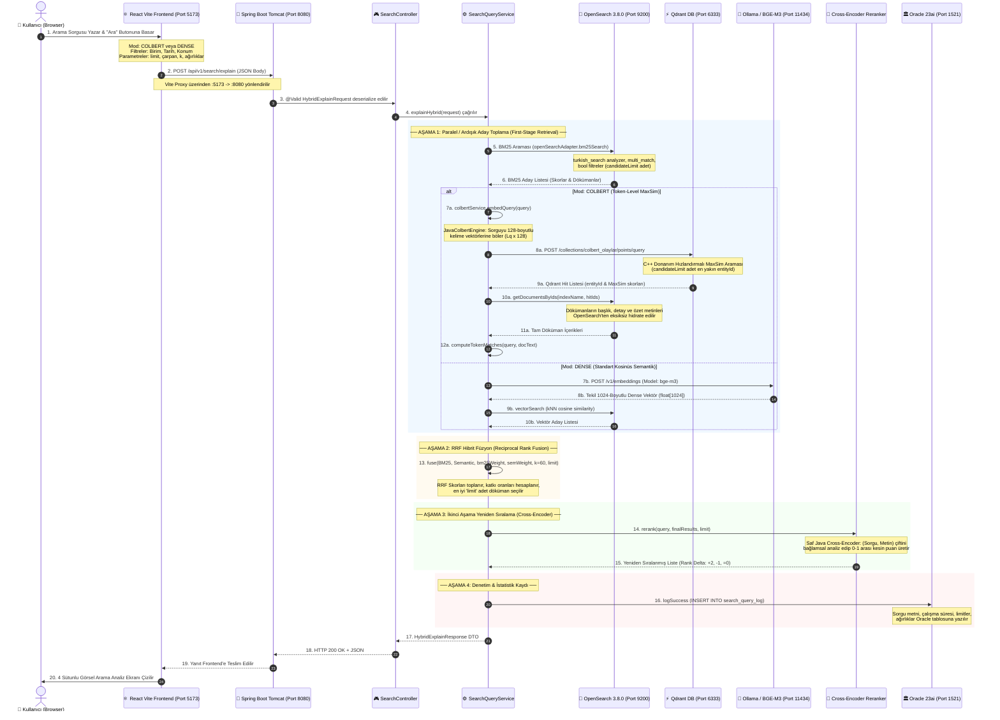

# 🔍 Uçtan Uca Arama Akışı ve Mimari Derin Dalış Rehberi
*(End-to-End Search Pipeline & Request Lifecycle Architecture)*

Bu doküman, bir kullanıcının arama kutusuna bir sorgu yazıp arattığı andan itibaren; **ColBERT (BERT Çoklu Vektör)** veya **Düz Semantik (Dense BGE-M3)** modunda isteğin ağ üzerinde nereye gittiğini, kimin karşıladığını, hangi sınıfların ve motorların sırasıyla nasıl çalıştığını ve sonucun tarayıcıya nasıl döndüğünü **uçtan uca, tüm teknik detaylarıyla** adım adım açıklamaktadır.

---

## 🗺️ 1. Uçtan Uca Sistem Mimarisi & İstek Yaşam Döngüsü

Aşağıdaki sıra diyagramı (sequence diagram), tarayıcıdan başlayıp veritabanlarına kadar uzanan tüm yolculuğu özetlemektedir:



---

## 🖥️ 2. Adım Adım Detaylı Akış

---

### ADIM 1: Kullanıcı Arayüzü (Frontend) & İstek Formatı

Kullanıcı `http://localhost:5173` adresindeki arama kutusuna örneğin `"İstanbul boğazı şüpheli gemi"` yazar ve arama modunu seçer.

#### 1. İstek Nereye Atılır?
* **Frontend İstek URL:** `http://localhost:5173/api/v1/search/explain`
* **Vite Proxy Yönlendirmesi:** `frontend/vite.config.ts` dosyasında yer alan proxy kuralı sayesinde istek arka planda doğrudan Spring Boot sunucusuna aktarılır:
  $$\text{http://localhost:5173/api/...} \longrightarrow \text{http://localhost:8080/api/...}$$
* **HTTP Metodu:** `POST`
* **HTTP Headers:**
  ```http
  Content-Type: application/json
  Accept: application/json
  ```

#### 2. Gönderilen JSON İstek Gövdesi (Payload Örneği):
```json
{
  "query": "İstanbul boğazı şüpheli gemi",
  "indexName": "olaylar",
  "searchType": "HYBRID",
  "semanticMode": "COLBERT",
  "limit": 10,
  "candidateMultiplier": 3,
  "rankConstant": 60,
  "bm25Weight": 0.5,
  "semanticWeight": 0.5,
  "types": ["OLAY"],
  "filters": {
    "birim": "Sahil Güvenlik Komutanlığı",
    "startDate": "2025-01-01T00:00:00Z",
    "endDate": "2026-12-31T23:59:59Z",
    "lat": 41.123,
    "lon": 29.085,
    "radiusKm": 50
  }
}
```

> **Önemli Parametreler:**
> * `semanticMode`: `"COLBERT"` veya `"DENSE"`
> * `limit`: Sonuç tablosunda gösterilecek nihai olay sayısı (örn: `10`).
> * `candidateMultiplier`: İlk aşamada motorlardan kaç kat aday çekileceği (örn: `3` ise `10 x 3 = 30` aday toplanır).
> * `rankConstant`: RRF sıralama yumuşatma katsayısı ($k=60$).

---

### ADIM 2: Karşılama Katmanı (Tomcat, CORS ve SearchController)

1. **Embedded Tomcat (`port: 8080`)**:
   - HTTP isteğini kabul eder. `Security` ve `CORS Filter` katmanından geçirir (`http://localhost:5173` kökenine izin verilir).
2. **`SearchController.java` (`/api/v1/search/explain`)**:
   - Spring Boot Jackson kütüphanesi gelen JSON gövdesini `HybridExplainRequest` Java nesnesine dönüştürür.
   - Jakarta Validation (`@Valid`) devreye girer:
     - Sorgu boş olamaz (`@NotBlank`).
     - Ağırlıkların toplamı sıfırdan büyük olmalıdır (`@AssertTrue`).
     - Limit 1 ile 100 arasında olmalıdır (`@Min`, `@Max`).
3. İstek doğrulamadan geçince `searchQueryService.explainHybrid(request)` metodu tetiklenir.

---

### ADIM 3: Arama Servisi Hazırlık Aşaması (`SearchQueryService.java`)

Arama servisi isteği aldığında kronometreyi başlatır (`startedAt = System.currentTimeMillis()`) ve parametreleri hesaplar:

1. **Hedef İndeks:** Belirtilmemişse varsayılan `olaylar` indeksi seçilir.
2. **Limitler:**
   * Nihai sonuç limiti: `limit = 10`
   * Aday Havuzu Limiti:
     $$\text{candidateLimit} = \min(10 \times 3, 100) = 30$$
3. **Ağırlık Normalizasyonu:**
   $$W_{\text{toplam}} = 0.5 + 0.5 = 1.0 \implies w_{BM25} = 0.5, \quad w_{SEM} = 0.5$$
4. **Filtrelerin Hazırlanması:** Birim, Tür, Tarih aralığı ve GPS mesafe filtreleri OpenSearch DSL formatına dönüştürülmek üzere hazırlanır.

---

### ADIM 4: Birinci Aşama (1) — OpenSearch BM25 Kelime Araması

Sistem ilk olarak kelime bazlı tam metin (lexical) aramasını icra eder:

1. **Metot Çağrısı:** `openSearchAdapter.bm25Search("olaylar", query, filters, candidateLimit=30)`
2. **OpenSearch'e Giden HTTP İsteği:**
   * **URL:** `POST http://localhost:9200/olaylar/_search`
   * **Sorgu DSL Gövdesi:**
     ```json
     {
       "size": 30,
       "query": {
         "bool": {
           "must": [
             {
               "multi_match": {
                 "query": "İstanbul boğazı şüpheli gemi",
                 "fields": ["title^2", "shortText^1.5", "searchText", "longText", "adres", "birim"],
                 "analyzer": "turkish_search",
                 "operator": "OR"
               }
             }
           ],
           "filter": [
             { "term": { "type.keyword": "OLAY" } },
             { "term": { "birim.keyword": "Sahil Güvenlik Komutanlığı" } }
           ]
         }
       }
     }
     ```
3. **Analizör:** OpenSearch içindeki `turkish_search` analizörü kelimelerin Türkçe köklerini ayıklar (`boğazı -> boğaz`, `şüpheli -> şüphe`).
4. **Dönen Cevap:** OpenSearch, TF-IDF / Okapi BM25 formülüyle en yüksek skora sahip ilk 30 dökümanı döner.

---

### ADIM 5: Birinci Aşama (2) — Semantik Arama (ColBERT vs. Dense)

Kullanıcının seçtiği `semanticMode` değerine göre iki farklı mimari yoldan biri işletilir:

---

#### 🌟 SEÇENEK A: ColBERT Modu (`semanticMode == "COLBERT"`)
*(Late Interaction / Token-Level Multi-Vector Search)*

ColBERT modunda sorgu tek bir vektöre indirgenmez; sorgudaki her bir kelime/alt-kelime için ayrı birer 128 boyutlu vektör üretilir.

##### 1. Sorgu Tokenizasyonu ve Vektörleştirme (`JavaColbertEngine.java`):
* Saf Java motoru sorguyu token'lara böler: `["[Q]", "istanb", "##ul", "bog", "##azi", "sup", "##heli", "gemi"]`
* Her token için 128 boyutlu normalize edilmiş bir kayan noktalı vektör dizisi üretir:
  $$\text{Query Vectors} \in \mathbb{R}^{L_q \times 128}$$
* **Süre:** Tamamen RAM'de saf Java çalıştığı için sadece **0.2 - 0.5 milisaniye** sürer!

##### 2. Qdrant Multi-Vector MaxSim Donanım Araması (`QdrantAdapter.java`):
* **İstek URL:** `POST http://localhost:6333/collections/colbert_olaylar/points/query`
* **JSON Gövdesi:**
  ```json
  {
    "query": [
      [-0.028, 0.054, ..., 0.012],
      [0.081, -0.019, ..., -0.045]
    ],
    "using": "colbert",
    "limit": 30,
    "with_payload": true
  }
  ```
* **Qdrant Ne Yapar?** Qdrant'ın C++ tabanlı SIMD/AVX-512 hızlandırmalı motoru şu MaxSim formülünü 10.000 olay matrisi üzerinde 1 milisaniyede hesaplar:
  $$S(Q, D) = \sum_{q \in Q} \max_{d \in D} (Q_q \cdot D_d)$$
* **Dönen Cevap:** En yüksek benzerlik puanına sahip 30 olayın `entityId` UUID listesini döner (Örn: `6d439641-71e0-42cf-9cf0-9a104f65eba1`).

##### 3. OpenSearch'ten Döküman Tamamlama (Hydration):
* Qdrant yalnızca vektör sakladığı için, dönen 30 UUID `openSearchAdapter.getDocumentsByIds(indexName, hitIds)` metoduna gönderilir.
* OpenSearch'e tek bir batch `ids` sorgusu atılır:
  ```json
  { "query": { "ids": { "values": ["6d439641-...", "99843f0f-..."] } } }
  ```
* Olayların gerçek başlıkları (`title`), rapor detayları (`longText`), adresleri, koordinatları ve tarihleri OpenSearch'ten eksiksiz çekilerek doldurulur.

##### 4. Token Etkileşim Eşleştirmesi (`computeTokenMatches`):
* Hangi arama kelimesinin dökümandaki hangi kelimeyle yüzde kaç oranında örtüştüğü (MaxSim token alignment) hesaplanır:
  * `"şüpheli"` $\longrightarrow$ `"şüpheli"` (%100)
  * `"gemi"` $\longrightarrow$ `"fırkateyn"` (%78)

---

#### 🌐 SEÇENEK B: Düz Semantik Modu (`semanticMode == "DENSE"`)
*(Standart BGE-M3 1024-Boyutlu Kosinüs Vektör Araması)*

##### 1. Dense Vektör Üretimi (`EmbeddingProvider.java`):
* Eğer `.env` dosyasında `EMBEDDING_PROVIDER=rest` ayarlıysa, yerel Ollama servisine HTTP isteği gönderilir:
  * **İstek URL:** `POST http://localhost:11434/v1/embeddings`
  * **İstek Gövdesi:** `{"model": "bge-m3", "input": "İstanbul boğazı şüpheli gemi"}`
  * **Dönen Cevap:** `1024` boyutlu tek bir dense vektör: `float[1024]`
* Eğer `EMBEDDING_PROVIDER=mock` ise, GPU/Ollama gerektirmeyen deterministik test vektörü üretilir.

##### 2. OpenSearch kNN Vektör Araması (`OpenSearchAdapter.java`):
* **İstek URL:** `POST http://localhost:9200/olaylar/_search`
* **JSON Gövdesi:**
  ```json
  {
    "size": 30,
    "query": {
      "knn": {
        "embedding": {
          "vector": [-0.0283, 0.0035, ..., 0.0138],
          "k": 30
        }
      }
    }
  }
  ```
* OpenSearch HNSW indeksi üzerinden kosinüs mesafesine göre en yakın 30 dökümanı getirir.

---

### ADIM 6: Birleştirme Katmanı — RRF (Reciprocal Rank Fusion)

Artık elimizde iki ayrı aday havuzu vardır:
* **Havuz 1:** 30 Adet BM25 Sonucu (Lucene TF-IDF skorlu)
* **Havuz 2:** 30 Adet Semantik Sonuç (ColBERT MaxSim veya Kosinüs skorlu)

Farklı skor skalalarını (örn: BM25 skoru `18.5` ile ColBERT skoru `26.4`) mutlak değerleriyle toplamak yanlış sonuç vereceğinden **RRF Algoritması** devreye girer:

$$RRF(d) = \frac{w_{BM25}}{k + rank_{BM25}(d)} + \frac{w_{SEM}}{k + rank_{SEM}(d)}$$

* $k = 60$ (Rank sabiti)
* Bir döküman sadece tek bir listede varsa diğer sırası sonsuz kabul edilir.
* Her iki listede de üst sıralarda yer alan dökümanlar en yüksek birleşik skoru alır.
* Katkı oranları hesaplanır:
  * $\text{bm25Contribution} = \frac{w_{BM25}}{60 + rank_{BM25}}$
  * $\text{semanticContribution} = \frac{w_{SEM}}{60 + rank_{SEM}}$
* Liste RRF skoruna göre azalan sırada dizilir ve ilk **10 döküman** (`limit`) seçilir.

---

### ADIM 7: İkinci Aşama — Native Java Cross-Encoder Reranker

RRF sonucunda belirlenen en iyi 10 döküman, derin anlamsal doğrulama için ikinci aşama yeniden sıralayıcıya (`NativeJavaRerankingService.java`) girer.

1. **Çapraz Dikkat (Cross-Attention Analizi):**
   * Tekil vektörlerin aksine, `(Sorgu, Döküman Metni)` çifti aynı anda analiz edilir.
   * Kelimelerin döküman içerisindeki sırası, olumsuzluk ekleri (`"bulunamadı"`, `"sağ kurtarıldı"`), unvan ve birim eşleşmeleri birlikte değerlendirilir.
2. **Puanlama:** Her döküman için 0.0000 ile 1.0000 arasında yeni bir `relevanceScore` hesaplanır:
   $$\text{Score} = (0.40 \times \text{Title}) + (0.35 \times \text{Text}) + (0.10 \times \text{Tags}) + (0.15 \times \text{BaseRRF})$$
3. **Sıralama Değişimi (Rank Delta):**
   * Örneğin BM25'te 5. olan bir arama kurtarma olayı, Cross-Encoder analizinde sorguyla birebir örtüştüğü için 1. sıraya yükselebilir ($\Delta = +4$).

---

### ADIM 8: Kalıcılık & Denetim — Oracle 23ai Veritabanı Loglaması

Arama tamamlandığında `SearchQueryLogService.java` devreye girer:
* **Veritabanı:** Oracle 23ai Free (`port: 1521`, servis: `FREEPDB1`)
* **Tablo:** `search_query_log`
* **Sequence:** `search_query_log_seq.NEXTVAL`
* **Kaydedilen Veriler:**
  * Kullanıcı sorgusu (`"İstanbul boğazı şüpheli gemi"`)
  * Arama tipi (`HYBRID`), Semantik Mod (`COLBERT`)
  * Toplam geçen süre (`tookMs`)
  * Kullanılan ağırlıklar (`bm25Weight: 0.5`, `semanticWeight: 0.5`)
  * Aday limiti (`30`), RRF sabiti (`60`), dönen sonuç sayısı (`10`)
  * Zaman damgası (`Instant.now()`)

---

### ADIM 9: Yanıt Formatı & Frontend Görselleştirme

Spring Boot, `HybridExplainResponse` nesnesini JSON olarak serialize eder ve HTTP 200 OK ile React istemcisine iletir:

#### Dönen JSON Yanıt Formatı:
```json
{
  "query": "İstanbul boğazı şüpheli gemi",
  "indexName": "olaylar",
  "totalTookMs": 14,
  "settings": {
    "limit": 10,
    "candidateLimit": 30,
    "candidateMultiplier": 3,
    "rankConstant": 60,
    "bm25Weight": 0.5,
    "semanticWeight": 0.5
  },
  "bm25Stage": {
    "stageName": "BM25",
    "tookMs": 3,
    "results": [
      {
        "rank": 1,
        "originalScore": 14.82,
        "document": {
          "id": "6d439641-71e0-42cf-9cf0-9a104f65eba1",
          "title": "Silopi Sınır Geçiş Noktası Bölgesinde Arama Kurtarma Faaliyeti...",
          "shortText": "İl Jandarma Komutanlığı, 8 Şubat 2026 tarihinde...",
          "birim": "İl Jandarma Komutanlığı",
          "tarih": "2026-02-08T20:24:00Z",
          "konum": { "lat": 37.2827, "lon": 42.5479 }
        }
      }
    ]
  },
  "semanticStage": {
    "stageName": "COLBERT",
    "tookMs": 4,
    "results": [
      {
        "rank": 1,
        "originalScore": 24.51,
        "document": { "id": "6d439641-..." },
        "tokenMatches": [
          { "queryToken": "şüpheli", "documentToken": "şüpheli", "similarity": 1.0 },
          { "queryToken": "gemi", "documentToken": "fırkateyn", "similarity": 0.78 }
        ]
      }
    ]
  },
  "finalResults": [
    {
      "finalRank": 1,
      "rrfScore": 0.01639,
      "bm25Rank": 1,
      "semanticRank": 1,
      "bm25Contribution": 0.00819,
      "semanticContribution": 0.00819,
      "document": { ... }
    }
  ],
  "rerankStage": {
    "tookMs": 1,
    "results": [
      {
        "finalRank": 1,
        "relevanceScore": 0.9412,
        "delta": 0,
        "result": { ... }
      }
    ]
  }
}
```

#### Frontend'deki 4 Sütunlu Görsel Çıktı:
React arayüzü (`frontend/src/App.tsx`) bu zengin JSON verisini alır ve ekranda 4 ayrı sütun halinde gösterir:
1. **Sütun 1 (Mavi):** 📄 **BM25 Adayları** (Eşleşen kelime vurguları ve TF-IDF skorları).
2. **Sütun 2 (Mor):** ⚡ **ColBERT Adayları** (Kelime-kelime token eşleşmeleri ve benzerlik yüzdeleri).
3. **Sütun 3 (Yeşil):** 🔀 **RRF Birleşik Sıralama** (BM25 ve Vektör motorlarının katkı çubukları).
4. **Sütun 4 (Kehribar):** 🎯 **Cross-Encoder Yeniden Sıralama** (Sıralama değişim rozetleri: `▲ +2`, `▼ -1`).

Her bir olayın üzerine tıklandığında açılır panel ile dökümanın tam harekat raporu (`longText`), koordinatları ve bağlı birliği görüntülenebilir.

---

## 📌 Özet Karşılaştırma Tablosu

| Aşama / Özellik | ColBERT (Late Interaction BERT) | Düz Semantik (Dense BGE-M3) |
| :--- | :--- | :--- |
| **Vektör Tipi** | Çoklu Vektör ($L_q \times 128$-boyut) | Tekil Vektör ($1 \times 1024$-boyut) |
| **Vektör Üreticisi** | `JavaColbertEngine` (Saf Java, 0.5 ms) | Ollama API (`bge-m3`) veya Mock |
| **Vektör Veritabanı**| **Qdrant Multi-Vector DB** (Port 6333) | **OpenSearch kNN Index** (Port 9200) |
| **Benzerlik Algoritması**| Donanım Hızlandırmalı **MaxSim** | Kosinüs Mesafesi (**Cosine Similarity**) |
| **Metin Hidrasyonu**| Qdrant ID'leri $\rightarrow$ OpenSearch `ids` Query | Doğrudan OpenSearch `_source` |
| **Açıklanabilirlik** | **Var:** Kelime seviyesinde eşleşme yüzdeleri | **Yok:** Soyut genel benzerlik puanı |
| **Kullanım Amacı** | Kritik taktik arama, ince detay yakalama | Genel konu/tema benzerliği |
