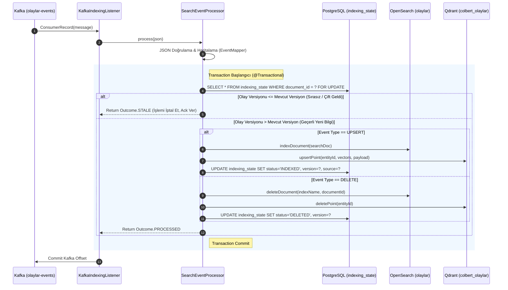

# 🛰️ Kafka Tabanlı Canlı Olay Akışı, Idempotency ve Simülasyon Mimarisi

Bu doküman; sistemin **Kafka KRaft altyapısını**, olayların (`events`) kuyruğa yazılmasını, **asenkron tüketici hattını (Consumer Pipeline)**, **dağıtık idempotency (çift kayıt önleme) mekanizmasını**, **versiyonlama mantığını** ve **canlı simülasyon producer mimarisini** derinlemesine açıklamaktadır.

---

## 🏗️ 1. Neden Event-Driven Akış ve Kafka?

Geleneksel arama sistemlerinde istemciler veritabanına doğrudan veya REST API üzerinden senkron yazar. Ancak yüksek hacimli kurumsal sistemlerde (örneğin sahadan binlerce sensör veya olay raporu aktığında):
1. **Backpressure ve Yük Dengeleme**: OpenSearch ve Qdrant aynı anda binlerce yoğun vektör üretimi isteğini karşılayamayabilir. Kafka, olayları güvenle tamponlayarak (buffer) sistemin kendi kapasitesine göre tüketmesini sağlar.
2. **Kayıpsız İletim (At-Least-Once Delivery)**: Herhangi bir servis geçici olarak çökse bile Kafka kuyruğundaki olaylar kaybolmaz; servis ayağa kalktığında kaldığı offset'ten devam eder.
3. **Sistem Ayrışması (Decoupling)**: Olayı üreten sistem ile arama motoru birbirine sıkı sıkıya bağlı (tightly coupled) değildir.

---

## ⚙️ 2. Kafka KRaft Altyapısı (Zookeeper'sız)

Projede `compose.yml` içinde Apache Kafka 3.7.0 resmi imajı kullanılmıştır. Zookeeper'a ihtiyaç duymadan **KRaft (Kafka Raft Metadata Mode)** ile tek düğüm (single-node) çalışır:

- **Broker Portu**: `localhost:9092`
- **Controller Portu**: `localhost:9093`
- **Varsayılan Topic**: `olaylar-events` (Spring Boot başladığında `TopicBuilder` ile otomatik oluşturulur).
- **Cluster ID**: `MkU3OEVBNTcwNTJENDM2Qk`

---

## 📨 3. Olay Sözleşmesi (Wire Contract - `SearchIndexingEvent`)

Kafka'ya basılan her mesaj, `SearchIndexingEvent` sözleşmesine uygun standart bir JSON nesnesidir:

```json
{
  "eventId": "a1b2c3d4-e5f6-7890-abcd-ef1234567890",
  "eventType": "OLAY",
  "documentId": "42d81a36-dd16-4aaf-b3d2-0f4df50d9b94",
  "version": 3,
  "data": {
    "id": "42d81a36-dd16-4aaf-b3d2-0f4df50d9b94",
    "title": "İstanbul Boğazı Kuzey Girişi Şüpheli Gemi Takibi",
    "shortText": "Hücumbot Filotilla Komutanlığı tarafından icra edilen trafik takip görevi...",
    "longText": "Sahil güvenlik botu tarafından yapılan takipte gemi rotasının olağan hat dışına çıktığı...",
    "searchText": "İstanbul Boğazı Kuzey Girişi Şüpheli Gemi Takibi Hücumbot Filotilla...",
    "fields": {
      "type": "Deniz Trafiği Takibi",
      "birim": "Hücumbot Filotilla Komutanlığı",
      "adres": "İstanbul Boğazı Kuzey Girişi, İstanbul",
      "konum": "41.4146, 29.1387",
      "tarih": "2025-08-01T00:08:00Z"
    }
  },
  "metadata": {
    "source": "SIMULATION_PRODUCER",
    "sentAt": "2026-09-20T22:00:00Z"
  }
}
```

### Olay Tipleri ve Yönlendirme (Event Routing):
`application.yml` dosyasındaki `search.kafka.routes` konfigürasyonu üzerinden:
- **`[OLAY]`**, **`[OLAY_BILDIRILDI]`**, **`[OLAY_GUNCELLENDI]`**: `operation: UPSERT` -> `olaylar` indeksine yazılır.
- **`[OLAY_SILINDI]`**: `operation: DELETE` -> `olaylar` indeksinden ve Qdrant'tan kaldırılır.

---

## 🔄 4. Tüketici Hattı (Consumer Pipeline) ve Dağıtık Idempotency

Kafka'dan bir mesaj geldiğinde çalışan zincir şu şekildedir:



### 🛡️ Dağıtık Idempotency ve Versiyon Kontrolü Nasıl Çalışır?
Ağ kesintisi veya consumer yeniden başlama durumlarında Kafka aynı mesajı 2 kere teslim edebilir (`at-least-once`). Sistem bu durumu şu adımlarla çözer:
1. **Satır Düzeyinde Kilit (`FOR UPDATE`)**:
   `repository.findByDocumentIdAndIndexNameForUpdate(documentId, route.indexName())`  
   PostgreSQL tablosundaki satır kilitlenir. Aynı dökümana ait başka bir Kafka partition veya thread aynı anda işlem yapamaz, sıraya girer.
2. **Versiyon Kontrolü (Out-of-Order Korunması)**:
   ```java
   if (state.getLastEventVersion() != null && event.version() <= state.getLastEventVersion()) {
       return Outcome.STALE;
   }
   ```
   Eğer veritabanında `version = 3` olan bir olay varken, gecikmiş bir `version = 2` olayı gelirse sistem bunu tespit eder; OpenSearch veya Qdrant'a dokunmadan **STALE** olarak işaretler ve geçer. Böylece eski veri yeni verinin üzerine yazılmaz.
3. **SHA-256 İçerik Hash Kontrolü**:
   Metin değişmemişse (örneğin sadece idari bir metadata güncellenmişse), pahalı yapay zeka embedding modeli tekrar çağrılmaz; mevcut vektör yeniden kullanılır.

---

## 🎬 5. Canlı Simülasyon Motoru (`OlaylarKafkaSimulationProducer`)

Sistemde gerçek bir saha akışını test etmek için geliştirilmiş **çift modlu** bir simülasyon producer'ı bulunur:

### Mod A: Web Arayüzü & REST API Üzerinden Kontrol
React arayüzündeki panel veya REST API üzerinden simülasyon arka planda başlatılıp durdurulabilir:
- **Başlatma**: `POST /api/v1/simulation/kafka/start?limit=1000&delayMs=50`
  - `limit`: Akıtılacak toplam olay sayısı (örn: 1000 veya tüm 10.000).
  - `delayMs`: İki olay arasındaki bekleme süresi (ms):
    - `100 ms` = Saniyede 10 olay (Rutin Akış)
    - `50 ms` = Saniyede 20 olay (Önerilen Canlı Hız)
    - `20 ms` = Saniyede 50 olay (Yoğun Akış)
    - `0 ms` = Burst / Yüksek Hızlı Yükleme
- **Durdurma**: `POST /api/v1/simulation/kafka/stop`
- **Canlı Durum**: `GET /api/v1/simulation/kafka/status`

### Mod B: Bağımsız Terminal CLI Scripti
Spring Boot ayağa kalkmadan veya harici bir batch makinesinden doğrudan Java `main` metodu ile çalıştırılabilir:
```bash
./mvnw test-compile exec:java \
  -Dexec.mainClass="com.example.semantic_search.simulation.OlaylarKafkaSimulationProducer" \
  -Dexec.args="--limit 500 --delay 50"
```

---

## 📊 6. Hata Dayanıklılığı (Resilience) ve Gözlemlenebilirlik (Metrics)

1. **Micrometer Metrikleri**:
   Her işlenen olay tipi Micrometer ve Prometheus formatında sayılır:
   - `search.kafka.events{outcome="processed"}`: Başarıyla indekslenen olaylar.
   - `search.kafka.events{outcome="stale"}`: Eski sürüm olduğu için elenen mükerrer olaylar.
   - `search.kafka.events{outcome="ignored"}`: Tanımsız eventType'a sahip olaylar.
2. **Spring Boot Health Indicator**:
   - `/actuator/health` endpoint'inde `openSearch` ve veritabanı sağlık kontrolleri canlı olarak raporlanır.
3. **Dead-Letter / Poision Pill Korunması**:
   Bozuk veya şemaya uymayan bir JSON mesajı geldiğinde `InvalidSearchEventException` fırlatılır; transaction geri alınır ve hata loglanır, consumer zincirinin kilitlenmesi önlenir.

---

## 🚀 7. Simülasyonu Çalıştırma ve Test Adımları

1. **Kafka'nın Çalıştığından Emin Olun**:
   ```bash
   docker compose ps
   # kafka konteyneri 'Up' (port 9092) durumunda olmalıdır.
   ```
2. **Web Arayüzüne Gidin**:
   [http://localhost:5173](http://localhost:5173) adresini açın.
3. **Akışı Başlatın**:
   Sol menüdeki **"🛰️ Canlı Kafka Akış Simülasyonu"** bileşeninden hızı seçin (örn: `20 olay / sn`) ve **"▶ Akışı Başlat"** butonuna basın.
4. **Gözlemleyin**:
   - Kafka sayacının hızla arttığını,
   - Spring Boot loglarında `Indexed document ... in olaylar` ve `Qdrant sync` mesajlarının aktığını,
   - Arama kutusuna yeni eklenen bir olayın kelimesini yazdığınızda anında arama sonuçlarına yansıdığını canlı olarak görebilirsiniz!
