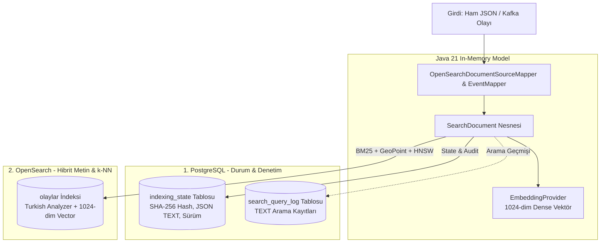

# 🗄️ Veri Depolama, Haritalama ve İndeksleme Mimarisi

Bu doküman, sistemdeki **ham verinin (olaylar.json, Kafka Olayları, REST API)** sistem tarafından nasıl okunduğunu, hangi katmanda ne formatta dönüştürüldüğünü ve **PostgreSQL** ile **OpenSearch** veritabanlarına nasıl kaydedildiğini adım adım ve teknik detaylarıyla açıklamaktadır.

---

## 🏗️ 1. Genel Mimari ve Uçtan Uca Veri Akışı

Sistemde dökümanlar 3 farklı kanaldan gelebilir:
1. **Kafka Olay Akışı (Event Streaming)**: `[OLAY]`, `[OLAY_BILDIRILDI]`, `[OLAY_GUNCELLENDI]` veya `[OLAY_SILINDI]`
2. **Toplu JSON İçe Aktarımı (Batch Ingestion)**: `olaylar.json` üzerinden doğrudan toplu yükleme
3. **Tekil REST API (Direct CRUD)**: `POST /api/v1/indexing`

Aşağıdaki şema, gelen bir olayın veritabanlarına eşzamanlı dağılımını gösterir:



---

## 📄 2. Ham Veri Formatı (`olaylar.json` & Kafka Event)

Sisteme giren ham olay dökümanı şu şekildedir:

```json
{
  "entityType": "OLAY",
  "entityId": "42d81a36-dd16-4aaf-b3d2-0f4df50d9b94",
  "title": "Hücumbot Filotilla Komutanlığı Sorumluluk Sahasında Şüpheli Gemi Takibi...",
  "shortText": "Hücumbot Filotilla Komutanlığı, 1 Ağustos 2025 tarihinde...",
  "longText": "Hücumbot Filotilla Komutanlığına bağlı sahil güvenlik botu...",
  "fields": {
    "fieldId": "79db11cb-46fe-4054-adb6-e5376dba3e7c",
    "type": "Deniz Trafiği Takibi",
    "konum": "41.4146, 29.1387",
    "adres": "İstanbul Boğazı Kuzey Girişi, İstanbul açıkları...",
    "tarih": "2025-08-01T00:08:00Z",
    "birim": "Hücumbot Filotilla Komutanlığı"
  },
  "timestamp": "2025-08-01T05:51:00Z",
  "version": 3
}
```

---

## 🏛️ 3. PostgreSQL Veri Modeli ve Saklama Formatı

PostgreSQL, sistemin **Single Source of Truth (Tek Gerçek Kaynak)** ve **İşlemsel Denetim (Audit & State Engine)** katmanıdır. İki temel tabloda veri tutulur:

### A. `indexing_state` Tablosu (Döküman Durumu ve Idempotency)
Dökümanların indekslenme durumu, Kafka versiyon takibi ve OpenSearch'e gönderilen kaynak verinin bir kopyası JSON TEXT olarak burada saklanır.

| Kolon Adı | Veri Tipi | Kısıt / Özellik | Açıklama |
| :--- | :--- | :--- | :--- |
| `id` | `BIGINT` | `PRIMARY KEY` (Sequence: `indexing_state_seq`) | Otomatik artan kayıt no |
| `document_id` | `VARCHAR(255)` | `NOT NULL` | Olayın benzersiz ID'si (`entityId`) |
| `index_name` | `VARCHAR(255)` | `NOT NULL` | Hedef indeks adı (örn: `olaylar`) |
| `status` | `VARCHAR(50)` | `NOT NULL` | Durum: `INDEXED`, `DELETED`, `FAILED`, `PENDING` |
| `search_text_hash` | `VARCHAR(64)` | Nullable | Arama metninin SHA-256 hash'i (Gereksiz yeniden vektörlemeyi önler) |
| `last_event_id` | `VARCHAR(128)` | Nullable | İşlenen son Kafka olayı ID'si |
| `last_event_version` | `BIGINT` | Nullable | Olay versiyonu (Eski/sırasız gelen Kafka olaylarını engeller) |
| `document_source` | `TEXT` | Nullable | OpenSearch'e basılan JSON'un PostgreSQL içindeki birebir kopyası |
| `error_message` | `TEXT` | Nullable | Olası indeksleme hatasının stack trace'i |
| `retry_count` | `INT` | Default 0 | Hata durumundaki tekrar deneme adedi |
| `created_at` | `TIMESTAMPTZ` | Default `CURRENT_TIMESTAMP` | Kayıt tarihi |
| `updated_at` | `TIMESTAMPTZ` | Default `CURRENT_TIMESTAMP` | Son güncelleme |

> **Benzersizlik Kısıtı (Unique Constraint)**:  
> `CONSTRAINT uq_document_index UNIQUE (document_id, index_name)`  
> Bu kısıt sayesinde Kafka'dan aynı anda çift olay gelse bile satır seviyesinde kilit (`FOR UPDATE`) ile yarış durumu (race condition) önlenir.

---

### B. `search_query_log` Tablosu (Sorgu ve Model Açıklanabilirlik Günlüğü)
Kullanıcıların `/api/v1/search` ve `/api/v1/search/explain` üzerinden attığı her sorgunun teknik detayı PostgreSQL'de TEXT olarak arşivlenir.

| Kolon Adı | Veri Tipi | Açıklama |
| :--- | :--- | :--- |
| `query` | `VARCHAR(2000)` | Kullanıcının girdiği ham arama cümlesi |
| `index_name` | `VARCHAR(255)` | Aranan indeks (`olaylar`) |
| `search_type` | `VARCHAR(50)` | `BM25`, `SEMANTIC`, `HYBRID` veya `HYBRID_EXPLAIN` |
| `took_ms` | `BIGINT` | Sorgunun toplam yanıt süresi (ms) |
| `bm25_took_ms` / `semantic_took_ms` | `BIGINT` | Her motorun harcadığı ayrık süre (ms) |
| `bm25_weight` / `semantic_weight` | `NUMERIC(5,4)` | RRF füzyonunda kullanılan katsayılar (örn: 0.5000) |
| `final_results_json` | `TEXT` | Dönen sonuçların skorları, rütbeleri ve metadata'sı (JSON formatında) |
| `settings_json` | `TEXT` | Sorgu parametreleri (`limit`, `offset`, `filters`) |
| `status` | `VARCHAR(20)` | `SUCCESS` veya `ERROR` |
| `created_at` | `TIMESTAMPTZ` | Sorgu zaman damgası |

> 💡 **Veritabanı Hazırlık Scriptleri**:
> - Yeni bir PostgreSQL 17 sunucusunda veritabanı ve kullanıcı açmak için: [`sql/init-postgres-17.sql`](file:///Users/macbookairm1/Desktop/semantic-search/sql/init-postgres-17.sql)
> - Tüm tablo ve sequence DDL şemasını tek dosyada çalıştırmak için: [`sql/schema-complete.sql`](file:///Users/macbookairm1/Desktop/semantic-search/sql/schema-complete.sql)

---

## 🔍 4. OpenSearch Veri Modeli ve Saklama Formatı

OpenSearch, **Metin Arama (BM25)**, **Coğrafi Konum Filtreleme (GeoPoint)** ve **Dense Vektör Arama (k-NN HNSW)** katmanıdır.

### A. İndeks Konfigürasyonu (`olaylar`)
- **Shards / Replicas**: 1 Shard, 0 Replica (geliştirme ve tek node optimizasyonu).
- **k-NN Özelliği**: `index.knn = true`.
- **Özel Türkçe Analyzer (`turkish_search`)**:
  - `tokenizer`: `standard`
  - `filters`: `lowercase`, `apostrophe`, `turkish_stop` (Türkçe bağlaçlar/stop words), `turkish_stemmer` (Türkçe morfolojik kök bulucu).

### B. Mappings (Alan Tanımları)

| Alan Adı | OpenSearch Tipi | Parametreler & Açıklama |
| :--- | :--- | :--- |
| `id` | `keyword` | Olay ID (Tam eşleşme) |
| `type` | `keyword` | Olay türü (Filtreleme için) |
| `title` | `text` | `analyzer: turkish_search`, alt alan: `title.keyword` (ignore_above: 256) |
| `searchText` | `text` | `analyzer: turkish_search` (Başlık, özet ve birimin birleşim metni) |
| `shortText` | `text` | `analyzer: turkish_search` (Kısa olay açıklaması) |
| `longText` | `text` | `analyzer: turkish_search` (Ayrıntılı olay raporu) |
| `birim` | `keyword` | Olayı işleyen askeri/mülki birim |
| `adres` | `text` | `analyzer: turkish_search`, alt alan: `adres.keyword` |
| `tarih` | `date` | Olayın gerçekleştiği ISO 8601 zaman damgası |
| `konum` | `geo_point` | Enlem/Boylam koordinatları (`{ "lat": 41.4146, "lon": 29.1387 }`) |
| `embedding` | `knn_vector` | **1024 boyutlu Dense Vektör**<br/>Engine: `faiss`<br/>Uzay Tipi: `cosinesimil`<br/>Metot: `hnsw` (`ef_construction: 256`, `m: 16`) |

### C. OpenSearch'e Basılan Örnek JSON Dokümanı
```json
{
  "id": "42d81a36-dd16-4aaf-b3d2-0f4df50d9b94",
  "type": "Deniz Trafiği Takibi",
  "title": "Hücumbot Filotilla Komutanlığı Sorumluluk Sahasında Şüpheli Gemi Takibi...",
  "searchText": "Hücumbot Filotilla Komutanlığı Sorumluluk Sahasında Şüpheli Gemi Takibi...",
  "shortText": "Hücumbot Filotilla Komutanlığı, 1 Ağustos 2025 tarihinde...",
  "longText": "Hücumbot Filotilla Komutanlığına bağlı sahil güvenlik botu...",
  "birim": "Hücumbot Filotilla Komutanlığı",
  "adres": "İstanbul Boğazı Kuzey Girişi, İstanbul açıkları...",
  "tarih": "2025-08-01T00:08:00Z",
  "konum": {
    "lat": 41.4146,
    "lon": 29.1387
  },
  "createdAt": "2026-09-20T22:00:00Z",
  "updatedAt": "2026-09-20T22:00:00Z",
  "embedding": [0.0142, -0.0521, 0.0891, "...(toplam 1024 float float sayı)..."]
}
```

---

## 🔄 5. Karşılaştırma Özeti: Hangi Veri Nerede Tutuluyor?

| Alan / Özellik | PostgreSQL (`indexing_state`) | OpenSearch (`olaylar`) |
| :--- | :--- | :--- |
| **Rolü** | Durum, Audit, Versiyon Kilidi | Ana Arama, BM25, GeoPoint, Dense HNSW |
| **Kimlik (ID)** | `document_id` (String) | `id` (Keyword) |
| **Metin Verisi** | `document_source` (TEXT JSON) | `searchText`, `title`, `longText` (Turkish Text) |
| **Vektör Verisi** | Tutulmaz (Yalnızca SHA-256 Hash) | **1024-dim Dense Vektör** (BGE-M3 / TEI embedding) |
| **Coğrafi Bilgi** | JSON içinde metin | **`geo_point`** (`lat`, `lon` sayısal indeksli) |
| **Silme Yönetimi** | `status = 'DELETED'` (Soft-delete) | Hard-delete (`DELETE /olaylar/_doc/{id}`) |

Bu mimari sayesinde sistem, hem kurumsal ilişkisel veritabanı güvenliğini (PostgreSQL ACID) hem de geniş ölçekli metin ve 1024-boyutlu HNSW vektör aramasını (OpenSearch) sıfır veri kaybı ile yürütmektedir.
